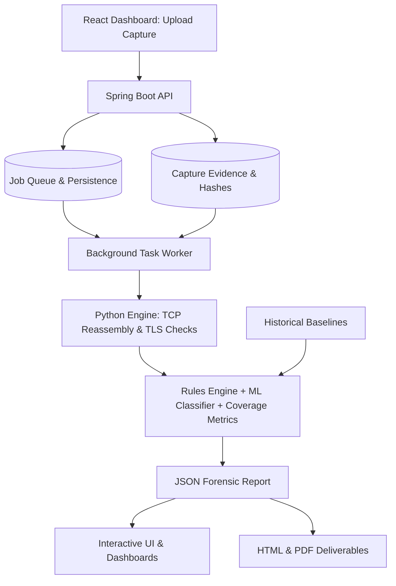

# MailSentinel

**MailSentinel** is an advanced, offline, passive cryptographic posture assessment engine engineered for modern enterprise email infrastructures. By ingesting network packet captures (PCAP/PCAPNG) of SMTP, IMAP, and POP3 traffic, MailSentinel reconstructs negotiated TLS sessions to thoroughly evaluate cryptographic health, cipher strength, certificate validity, and protocol behaviors.

Unlike active vulnerability scanners that probe a server for capabilities it claims to support, MailSentinel observes the reality of what your infrastructure *actually* negotiates with real-world clients in production.

---

## 1. Executive Summary

Email remains critical infrastructure. Despite widespread TLS adoption, SMTP, IMAP, and POP3 deployments still suffer from obsolete TLS versions, weak ciphers, insecure STARTTLS implementations, and bad certificates, exposing them to downgrade and MITM attacks. Existing network analysis tools give packet-level visibility but do not automatically assess cryptographic posture or give risk-prioritized guidance.

MailSentinel is an AI-assisted passive network forensic framework that automatically assesses the cryptographic security posture of enterprise email infrastructure. It reconstructs sessions, identifies encryption transitions, analyzes TLS negotiations, validates certificates, detects weaknesses, and uses Machine Learning to classify risk and detect anomalous behavior.

## Core Capabilities

- **Protocol & Session Reconstruction:** Automatically spots SMTP, IMAP, POP3 email traffic, rebuilds TCP stream conversations, and checks STARTTLS encryption upgrades.
- **TLS Handshake Analysis:** Replays the secure-connection handshake, showing agreed TLS version, cipher suite, key exchange method, and Forward Secrecy check.
- **X.509 Certificate Validation:** Extracts certificates, verifies trust chain, checks expiry, identifies public key algorithm & length, digital signature type.
- **Cryptographic Weakness Detection:** Flags outdated TLS versions, weak cipher suites, unsafe algorithms, risky protocol settings, certificate flaws.
- **AI/ML Intelligence Engine:** Uses cryptographic features to classify risk, catch unusual TLS behaviour, score security health, rank threats and suggest fixes.
- **Forensic Reporting & Dashboard:** Urgency-ranked security issues, downloadable reports in JSON, PDF and HTML, plus an interactive visual dashboard for SOC teams.

---

## 2. Architecture

MailSentinel is built using a decoupled, highly scalable three-tier architecture:



### Component Breakdown
- **Frontend (React, Vite, Tailwind CSS):** Handles the user interface, upload flows, progress tracking, investigation history, and report exploration.
- **Backend (Java Spring Boot):** Serves as the API gateway. It validates uploads, manages PostgreSQL/H2 persistence, and orchestrates the execution of background analysis jobs.
- **Engine (Python 3.10+):** The heavy-lifting forensic worker. It leverages `pyshark`/`tshark` for field extraction and `scapy` for raw TCP segment boundary checks.

---

## 3. Analysis Pipeline

### A. TCP Stream Reconstruction
MailSentinel groups packets by their 5-tuple, reorders by sequence number, and handles retransmissions and fragmentation. It identifies the client and server roles authoritatively based on the TCP SYN direction or standard port heuristics.

### B. Protocol & STARTTLS Analysis
The engine parses SMTP, IMAP, and POP3 command states. It evaluates STARTTLS transitions across six distinct states:
1. `NEVER_OFFERED`
2. `OFFERED_NOT_USED`
3. `UPGRADED_SUCCESS`
4. `UPGRADED_FAILED`
5. `IMPLICIT_TLS`
6. `STRIPPED_SUSPICIOUS`

**STARTTLS Command Injection:** MailSentinel inspects raw TCP segment boundaries around the client's `STARTTLS` command and the server's affirmative response. If extra bytes are pipelined in the same segment before the TLS handshake begins, it flags a High-Severity injection vulnerability.

### C. TLS & Cipher Suite Analysis
MailSentinel parses negotiated TLS versions and cipher suites, mapping them to normalized cryptographic schemas:
- **Key Exchange:** Checks for ephemeral forward secrecy (ECDHE/DHE).
- **Encryption Mode:** Identifies AEAD vs. legacy CBC modes.
- **TLS 1.3 Nuance:** In TLS 1.3, certificates are encrypted by design. The engine explicitly notes `TLS13_CERT_NOT_OBSERVABLE` rather than asserting false missing-certificate vulnerabilities.

### D. Certificate Analysis
Using the `cryptography` Python library, MailSentinel extracts the Subject, Issuer, SANs, Validity boundaries, Key algorithms, and Signature hashes. It validates the chain against bundled trust stores to classify certificates as `VALID`, `EXPIRED`, `SELF_SIGNED`, `HOSTNAME_MISMATCH`, or `WEAK_KEY`.

---

## 4. Deterministic Rule Engine

Every finding is evaluated against a deterministic, citation-backed rule engine. Findings are scoped by Severity (Critical, High, Medium, Low) and Confidence.

| Rule | Trigger Condition | Severity | Reference |
|---|---|---|---|
| **NO_ENCRYPTION** | Session never used TLS (no STARTTLS attempted, not implicit-TLS port) | **CRITICAL** | RFC 8314 |
| **STARTTLS_STRIPPED** | STARTTLS advertised/requested, but plaintext app data continued | **CRITICAL** | RFC 3207 |
| **CREDENTIALS_IN_CLEARTEXT** | AUTH/LOGIN observed before TLS upgrade | **CRITICAL** | RFC 8314 |
| **INJECTION_SUSPECTED** | Extra command bytes in same segment as STARTTLS | **HIGH** | USENIX Sec'21 |
| **OBSOLETE_TLS** | Negotiated version is SSLv3, TLS 1.0, or TLS 1.1 | **HIGH** | NIST SP 800-52r2 |
| **WEAK_CIPHER** | Suite uses RC4, 3DES, NULL, or MD5 | **HIGH** | NIST SP 800-52r2 |
| **NO_FORWARD_SECRECY** | Key exchange is static RSA, not ECDHE/DHE | **MEDIUM** | NIST SP 800-52r2 |
| **CERT_EXPIRED** | `not_valid_after` < capture timestamp | **HIGH** | RFC 5280 |
| **CERT_SELF_SIGNED** | Subject == Issuer | **MEDIUM** | RFC 5280 |

---

## 5. Machine Learning & AI

MailSentinel uses Machine Learning specifically for **Anomaly Detection**, never to replace deterministic rules.

- **Isolation Forest (Unsupervised):** Flags sessions that exhibit anomalous structural behavior that deterministic rules might not yet penalize. It calculates a path-length anomaly score without requiring labeled "normal" traffic.
- **Random Forest (Supervised):** A lightweight classifier trained to approximate and generalize risk classes, aiding in the prioritization of findings for SOC analysts.

---

## 6. Installation & Setup (Dockerized)

MailSentinel is now fully containerized. You do not need to install Python, Java, or Node.js locally on your host machine to run the platform.

### Quick Start with Docker Compose

1. **Clone the repository:**
   ```bash
   git clone https://github.com/zaidshaikh987/Mail_Sentinel.git
   cd Mail_Sentinel
   ```

2. **Launch the entire stack:**
   This single command builds the React dashboard, compiles the Spring Boot API, sets up the Python forensic engine, trains the ML model, and boots the PostgreSQL database.
   ```bash
   docker compose up --build -d
   ```

3. **Access the Dashboard:**
   Open your browser and navigate to **http://localhost:8080**.

### Architecture inside Docker
- `sms-postgres`: A lightweight Postgres 16 database holding investigation metadata.
- `sms-app`: A single unified container that serves the React frontend, runs the Spring Boot REST API, and executes the Python PCAP engine in an isolated virtual environment.

---

## 7. Usage Guide

1. **Create an Investigation:** Open the dashboard at `http://localhost:5173`. Create a new investigation namespace (e.g., "Corporate Mail Edge") to group related captures.
2. **Upload Evidence:** Drag and drop a `.pcap` or `.pcapng` file. Processing happens locally; packets are never transmitted externally.
3. **Monitor Analysis:** Watch the job pipeline process TCP reconstruction, TLS checks, rules mapping, and ML aggregations.
4. **Review Posture:** Start with the lowest grades. Open a session to inspect handshake details, certificates, rule explanations, and redacted cleartext transcripts.
5. **Export Deliverables:** Export the interactive HTML or PDF report for executive review, or download JSON for SIEM integrations.

---

## 8. Limitations & Future Work

- **Passive Visibility Limitations:** MailSentinel can only assess recorded traffic. Missing packets or encrypted TLS 1.3 certificates limit available checks. A clean grade indicates no *observed* vulnerabilities.
- **Revocation Checking:** OCSP/CRL freshness is not reliably knowable from a passive capture without also capturing the active OCSP traffic.
- **Future Scope:** SNI-to-cert matching at full rigor (MTA-STS/DANE), persistent cross-scan organizational trend dashboards, and JA3/JA4-based client fingerprinting.

## License

This project is licensed under the MIT License. See `LICENSE` for more information.
