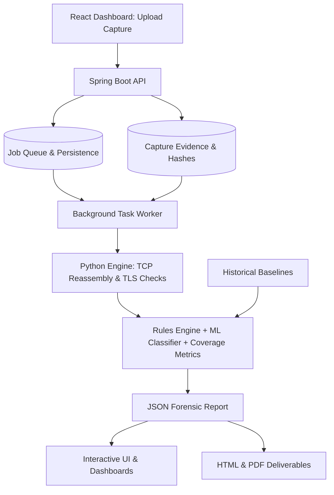

# MailSentinel

**MailSentinel** is an advanced, offline, passive cryptographic posture assessment engine engineered for modern enterprise email infrastructures. By ingesting network packet captures (PCAP/PCAPNG) of SMTP, IMAP, and POP3 traffic, MailSentinel reconstructs negotiated TLS sessions to thoroughly evaluate cryptographic health, cipher strength, certificate validity, and protocol behaviors.

Unlike active vulnerability scanners that probe a server for capabilities it claims to support, MailSentinel observes the reality of what your infrastructure *actually* negotiates with real-world clients in production.

## Key Features

- **Passive Network Analysis:** No packets are transmitted, and no active connections are made to your servers. MailSentinel operates entirely offline on captured evidence.
- **Deep Protocol Inspection:** Reconstructs TCP streams to detect early cleartext commands, STARTTLS strip attacks, authentication downgrade attempts, and improperly pipelined payloads.
- **SSL Labs Grading Methodology:** Grades negotiated sessions from `A+` to `F` using the rigorous, published Qualys SSL Server Rating Guide logic. The engine penalizes deprecated protocols, weak ciphers (RC4, 3DES, NULL), and expired, untrusted, or mismatched certificates.
- **Heuristic & Machine Learning Anomaly Detection:** Applies Isolation Forest machine learning models alongside deterministic rule engines (powered by Scapy and TShark) to flag unusual behavior, anomalous handshakes, and baseline deviations over time.
- **Forensic Reporting:** Generates beautiful, self-contained HTML and PDF reports detailing prioritized remediation lists, treeSHAP model attributions, and visual distributions of risk.
- **Interactive React Dashboard:** A dynamic Vite/React dashboard for exploring server assessments, comparing historical captures, and tracking remediation metrics.

## Architecture

MailSentinel is built using a decoupled, highly scalable three-tier architecture:



1. **Frontend (React, Vite, Tailwind CSS):** Handles the user interface, upload flows, progress tracking, investigation history, and report exploration. The dashboard visualizes the JSON output using interactive Recharts graphs.
2. **Backend (Java Spring Boot):** Serves as the API gateway. It validates uploads, manages PostgreSQL/H2 persistence, and orchestrates the execution of background analysis jobs to prevent blocking the UI.
3. **Engine (Python 3.10+):** The heavy-lifting forensic worker. It leverages `pyshark`/`scapy` to reconstruct TCP streams, fingerprint X.509 certificates, compute cryptographic posture, and apply ML models for anomaly classification.

## Installation & Setup

MailSentinel requires **Python 3.10+**, **Java 17+**, and **Node.js 18+**.

### 1. Set up the Python Engine
The backend engine handles all protocol and cryptographic analysis.
```bash
# Create and activate a virtual environment
python -m venv .venv
source .venv/bin/activate  # On Windows: .venv\Scripts\activate

# Install the engine and its ML dependencies
pip install -e "./engine[dev,ml]"
```

### 2. Set up the React Dashboard
The frontend provides the interactive analyst experience.
```bash
cd frontend
npm install
npm run build
cd ..
```

### 3. Run the API & Workers
The Spring Boot backend orchestrates the analysis pipeline.
*(Ensure you have Maven installed)*
```bash
export MS_PYTHON="$PWD/.venv/bin/python" # Tell Java where the engine is
mvn -f backend/pom.xml spring-boot:run
```
*(On Windows PowerShell, use `$env:MS_PYTHON="$PWD\.venv\Scripts\python.exe"` before running Maven).*

## Usage Guide

1. **Create an Investigation:** Open the dashboard at `http://localhost:5173`. Create a new investigation namespace (e.g., "Corporate Mail Edge") to group related captures.
2. **Upload Evidence:** Drag and drop a `.pcap` or `.pcapng` file. The file never leaves your machine—it is processed locally by the Python worker.
3. **Monitor Analysis:** Watch the job pipeline process TCP reconstruction, TLS checks, rules mapping, and ML aggregations in real-time.
4. **Review Posture:** Start with the lowest grades. The engine provides prioritized remediation steps (e.g., "Enforce TLS 1.2 minimum"). Open a session to inspect handshake details, certificates, rule explanations, and redacted cleartext transcripts.
5. **Export Deliverables:** Download the machine-readable JSON for SIEM integrations or export the interactive HTML/PDF report for executive review.

## Validation & Boundaries

- **Passive Visibility Limitation:** MailSentinel can only assess recorded traffic. Missing packets or encrypted TLS 1.3 certificates limit available checks. A clean grade indicates no observed vulnerabilities, not the absence of unobserved ones.
- **Test Suite:** The Python engine is backed by over 160 strict `pytest` cases ensuring cryptographic math and rule mapping align perfectly with industry standards.
- **Performance:** Designed for offline forensic processing. For extremely large multi-gigabyte PCAPs, filtering the capture beforehand using `tcpdump` or `wireshark` for ports `25, 110, 143, 465, 587, 993, 995` is recommended to reduce processing time.

## License

This project is licensed under the MIT License. See the `LICENSE` file in the repository root for more details.
