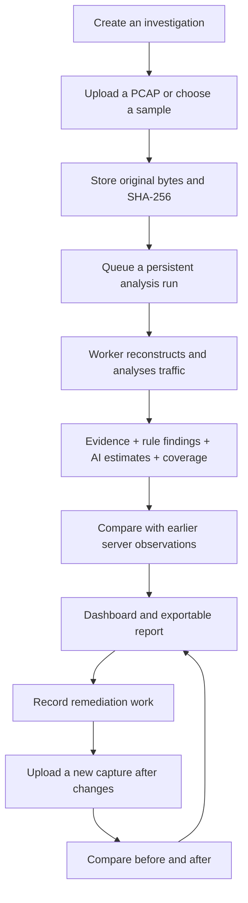
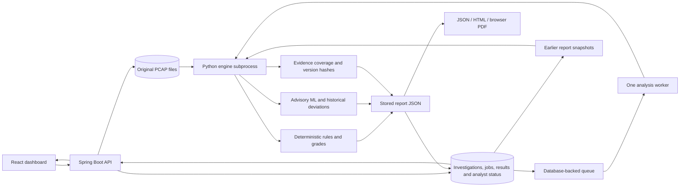
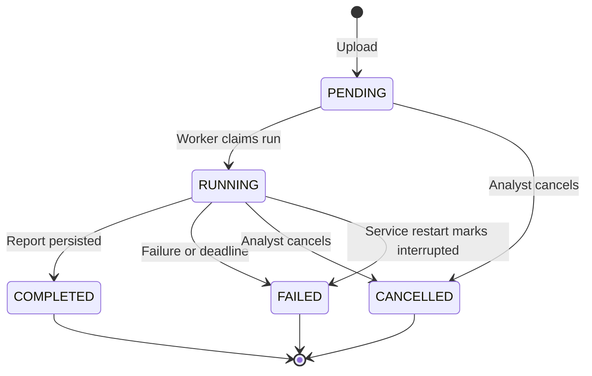
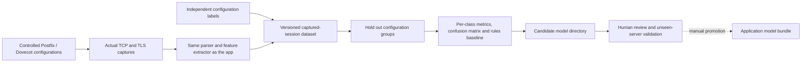

# MailSentinel: investigation architecture

MailSentinel now organizes passive capture analysis into investigations. It preserves
observed evidence, keeps deterministic findings separate from model estimates, records
visibility limits, and compares repeated observations without claiming an unseen problem
has been fixed.

## 1. The path an analyst follows

An **investigation** is a folder of related evidence, such as a review of an organisation's
mail infrastructure. A **capture** is a recorded traffic file. An **analysis run** is one
execution of the engine against that evidence. In this prototype, the existing `capture`
table also represents the run: a retry creates a new row pointing to the same stored file,
linked by `source_capture_id`. This avoids replacing earlier results.

## 2. Runtime components

### React dashboard

`/` is the upload screen, with an investigation selector. `/jobs/:id` polls the backend
for actual stage events and offers cancellation or retry. `/investigations` lists
investigations and all runs; `/investigations/:id` groups evidence, exposes the server
observation history and compares completed runs. Existing report/session/export screens
remain, with coverage, historical observations and provenance added.

The browser no longer waits for analysis inside its upload request. Closing the page does
not cancel a server job. The browser receives the original stored report shape, so detailed
findings, transcripts, certificate data and model explanations stay available in session views.

### Spring Boot API and persistence

The API validates and hashes uploads, assigns them to investigations and persists jobs.
The new Flyway V2 migration adds `investigation`, capture/run metadata and
`remediation_status`; old captures remain accessible as standalone runs.

Original captures are stored under UUID-prefixed filenames. H2 is the local default;
the existing PostgreSQL configuration remains available. Full engine JSON is the result
of record. Relational session and asset rows support existing API views.

API groups:

| Endpoint | Purpose |
|---|---|
| `POST /api/investigations` | Create a named investigation |
| `GET /api/investigations` | List investigations |
| `GET /api/investigations/{id}` | Runs, latest observed server identities and remediation status |
| `POST /api/captures?investigationId=...` | Upload and enqueue |
| `POST /api/captures/demo/{name}?sync=false&investigationId=...` | Enqueue a bundled sample |
| `GET /api/captures/{id}` | Job stage, summary and stored report |
| `POST /api/captures/{id}/cancel` | Cancel queued/running work |
| `POST /api/captures/{id}/retry` | Create a new run from retained evidence |
| `GET /api/investigations/{id}/compare?before=...&after=...` | Compare completed runs from one investigation |
| `PUT /api/investigations/{id}/remediation` | Record analyst status and optional note |

### Durable jobs and the worker

`AnalysisQueue` checks persisted PENDING runs once per second. `AnalysisService` serializes
execution: this is a **single-instance worker**, not a distributed queue. The database is
the durable queue; there is no separate Redis/RabbitMQ service to operate.

Retry creates a **different run ID**; it does not reset this state machine. Pending jobs
survive restart. Interrupted running jobs become failed with an explicit explanation and
can be retried. They are not silently retried, because results and failure history should
remain auditable.

Database transactions are short and do not wrap a Python process. Progress commits remain
visible while the engine runs. The subprocess writes JSON to stdout and prefixed stage
events to stderr. Stages are reading, reassembly, TLS/certificates, rules/coverage, ML,
aggregation and history comparison. There is no fabricated completion percentage.

The process boundary enforces the existing default 300-second deadline while simultaneously
reading stdout/stderr. Cancellation is checked at roughly 200 ms intervals while the process
runs, then forcibly terminates it and descendants. Output is capped at 64 MiB. Linux analysis
processes also use a 4096 MiB virtual-address-space limit, configurable via
`SMS_MAX_MEMORY_MB`. This Python address-space limit is not applied on macOS. The existing
64 MiB per-stream reconstruction limit also remains. None of these limits constitutes a
large-capture performance benchmark.

## 3. Four different answers, kept separate

| Layer | Question | Example |
|---|---|---|
| Observed evidence | What bytes/metadata were recorded? | Negotiated TLS 1.2 and certificate fingerprint |
| Rule findings | Which known weakness is present? | Self-signed certificate |
| AI estimate | What posture or unusual behavior does the model suggest? | Predicted weak; deviation from prior sessions |
| Coverage | What could actually be checked? | Certificate unobservable in TLS 1.3 |

Coverage reports stream gaps, truncation, protocol inference, handshake visibility,
certificate visibility, trust-path checks, hostname checks and revocation limitations.
It counts assessed checks but does not call that number a security score. A cleartext
session can be well observed and insecure; an A+ TLS session can have limited certificate
visibility. No passive capture can recover bytes that were not recorded.

Rule findings and grades remain deterministic. Neither the classifier nor the anomaly
model can mutate them. The existing within-capture anomaly result is retained; the new
historical assessment is labelled separately. This keeps old reports compatible and lets
analysts distinguish "unusual in this file" from "unusual relative to previous files".

## 4. Historical server baselines

Historical observations are derived from persisted report snapshots within the same
investigation. The identity key is protocol + normalised hostname + server IP + port.
Certificate fingerprints are compared as observations; they are not used to silently
merge hosts. Without a hostname the endpoint identity is provisional and cannot establish
an ML baseline. IP/hostname changes deliberately produce separate identities.

For a historical ML baseline the engine requires:

- At least 8 prior sessions across at least 2 distinct capture hashes.
- An earlier capture end time than the current capture start time.
- Matching hostname and endpoint.
- No recorded stream gaps or capture truncation in the baseline sessions.

The current capture, duplicate uploads and future/overlapping captures are excluded.
An Isolation Forest is fitted on the eligible **earlier sessions**, then scores the new
sessions. It reports unusualness, not maliciousness. TLS, cipher, STARTTLS and certificate
changes are also shown directly as deterministic observations.

A baseline result is frozen into its run's report. Uploading older evidence later does not
rewrite existing results; explicitly create a new run to assess with the enlarged history.
Legacy reports without coverage data are conservatively excluded from model baseline inputs.

Limitations: thresholds are prototype defaults, not validated detection operating points.
Different legitimate clients can negotiate differently; baselines can also include bad
configurations. There is no automatic hostname reassignment or entity-resolution model.

## 5. Comparing captures and tracking remediation

Comparison matches exact observed identities and rule IDs. It distinguishes:

- **Newly observed**: appears only in the selected later run.
- **Still observed**: appears in both.
- **Not observed in later capture**: appears only in the selected earlier run.

The last state does **not** mean resolved. The server may be absent, the certificate may
be encrypted, or the capture may omit the relevant conversation. Coverage and version
changes are displayed alongside the comparison. Identical evidence hashes and reversed
capture timestamps produce explicit caveats.

Analyst remediation status is separate: open, in progress, or fix reported by analyst.
A claimed fix is not automatically treated as verified. Status is scoped to the investigation
and observed finding key. This prototype stores current status and note, not a complete
multi-user edit audit trail.

## 6. Reproducibility

Each new report records engine version, engine Python-source hash, rule-file hash, cipher
registry hash, model-file hash, trust-root-set hash, Python version and whether ML was enabled
and applied. The evidence hash is checked again against the upload hash before the report
is accepted. Retrying leaves the old report intact.

Hashes identify the components used; they do not archive those component files. For forensic
retention, keep the corresponding application build, model bundle, configuration and trust
store along with the report. Full environment/container digest pinning is future hardening.

## 7. Separate training and evaluation pipeline

`lab/` contains an isolated Docker lab using actual Postfix and Dovecot. Runtime networking
is disabled except loopback. It produces cleartext/TLS 1.2/TLS 1.3 sessions, with three
batches per protocol/configuration and a manifest of known configuration labels.

`mailsentinel.ml.captured_dataset` runs the application parser on each manifest capture
and emits JSONL rows with features, independently provided labels, configuration groups,
evidence hashes and a deterministic baseline class. Duplicate evidence and cross-group
capture reuse are rejected. `ml.train --dataset ... --artifacts ...` uses grouped evaluation
and writes a candidate separately from the deployed model.

The shipped starter lab covers **critical and weak only**, because encrypted fixtures use
self-signed certificates. Training deliberately requires all four classes and will refuse
this incomplete starter corpus. Add secure and vulnerable configurations plus server/client
diversity before training. This is a guardrail against deploying an incomplete classifier,
not a claim that the ML validation work is finished. See `lab/README.md` for commands.

The existing model remains deployed; this change does not invent new accuracy figures.
The Docker daemon was unavailable during implementation, so the new lab was not run here.
No new real-capture-trained model or performance benchmark is claimed.

## 8. Deployment boundaries and next scale step

The delivered runtime is a modular Spring Boot application and an isolated Python subprocess,
with a database-backed single worker. Do not run multiple app replicas against this queue:
startup recovery currently assumes only one instance owns running jobs. For horizontal scale,
replace recovery with leases/heartbeats, use atomic leased claims and move workers into
separately resource-limited containers. Add authentication, access control and immutable
analyst audit events before a shared production deployment. These are not represented as
completed features in this prototype.

## 9. Demonstration sequence

1. Open Investigations and create a review.
2. Upload a capture into that review and watch the actual job stages.
3. Open its report: show grade, coverage and packet-supported findings separately.
4. Open a session to inspect certificates, rules and model reasoning.
5. Upload another capture into the same review and compare both runs.
6. Point out that a missing finding is labelled "not observed", not "fixed".
7. Track remediation and export the stored report.
8. Use distinct chronological lab batches to demonstrate an established historical baseline.
